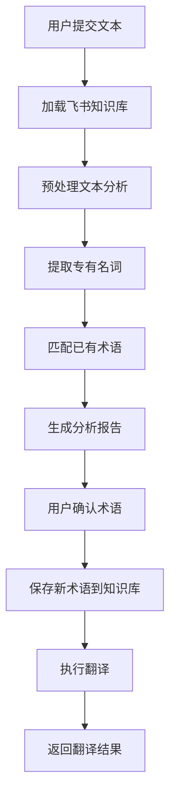

# 本地化翻译系统

本项目已从 Dify API 迁移到本地 Agent 架构，使用 Claude API 和自定义工具实现翻译功能。

## 架构变更

### 旧架构（Dify API）
```
前端 → Express服务器 → Dify API → 返回结果
```

### 新架构（本地Agent）
```
前端 → Express服务器 → 本地Agent → Claude API + 飞书API + 本地工具 → 返回结果
```

## 核心组件

### 1. 三个MCP工具

#### 工具1: 飞书知识库 (`server/agent/tools/feishu-knowledge-base.js`)
- **功能**: 管理术语对照表
- **操作**:
  - 加载飞书云文档中的术语库
  - 查询特定术语翻译
  - 添加新术语到知识库
- **缓存**: 30分钟本地缓存

#### 工具2: 预处理文本 (`server/agent/tools/preprocess-text.js`)
- **功能**: 分析待翻译文本
- **能力**:
  - 识别文档领域、风格、用途
  - 提取专有名词
  - 匹配已有术语
  - 生成详细分析报告
- **AI模型**: Claude 3.5 Sonnet

#### 工具3: 翻译Agent (`server/agent/tools/translate-agent.js`)
- **功能**: 执行专业翻译
- **特性**:
  - 应用确认的术语
  - 自动分段处理长文本
  - 保持术语一致性
  - 尊重翻译策略
- **AI模型**: Claude 3.5 Sonnet

### 2. Agent协调器 (`server/agent/index.js`)

负责协调三个工具的调用，实现完整的翻译工作流：
1. 加载知识库 → 
2. 预处理文本 → 
3. 用户确认术语 → 
4. 保存新术语 → 
5. 执行翻译

## 环境配置

在项目根目录的 `.env` 文件中添加以下配置：

```bash
# 服务器配置
PORT=3001
NODE_ENV=development

# 选择模式: true使用本地Agent, false使用Dify API
USE_LOCAL_AGENT=true

# Claude API配置（本地Agent必需）
ANTHROPIC_API_KEY=your_anthropic_api_key_here
# 或
CLAUDE_API_KEY=your_claude_api_key_here

# 飞书配置（可选，不配置会使用模拟数据）
FEISHU_APP_ID=your_feishu_app_id
FEISHU_APP_SECRET=your_feishu_app_secret

# Dify配置（仅在USE_LOCAL_AGENT=false时需要）
DIFY_API_KEY=your_dify_api_key
DIFY_BASE_URL=https://api.dify.ai/v1
DIFY_APP_ID=your_dify_app_id
```

## 安装依赖

```bash
# 安装主项目依赖
npm install

# 如果要使用独立的MCP服务器（可选）
cd mcp-server
npm install
```

## 启动服务

### 开发模式

```bash
# 启动后端服务器（本地Agent模式）
npm run server

# 启动前端开发服务器（新终端）
npm run dev

# 或使用启动脚本
./start-dev.sh
```

### 切换模式

在 `.env` 文件中修改：

```bash
# 使用本地Agent
USE_LOCAL_AGENT=true

# 使用Dify API
USE_LOCAL_AGENT=false
```

## API接口

接口与之前保持一致，前端无需修改：

### 1. 提交文本分析
```http
POST /api/submit-text
Content-Type: application/json

{
  "text": "待翻译文本",
  "language_from": "ZH",
  "language_to": "EN-US",
  "sessionId": "可选"
}
```

### 2. 确认术语
```http
POST /api/confirm-nouns
Content-Type: application/json

{
  "sessionId": "会话ID",
  "confirmedNouns": [
    {
      "original": "激光雷达",
      "translation": "LiDAR",
      "confirmed": true
    }
  ]
}
```

### 3. 开始翻译
```http
POST /api/start-translation
Content-Type: application/json

{
  "sessionId": "会话ID",
  "userInput": "开始翻译"
}
```

### 4. 文件上传
```http
POST /api/upload-file
Content-Type: multipart/form-data

file: [文件]
```

### 5. 历史记录
```http
GET /api/history?page=1&pageSize=10&searchText=关键词
```

## 工作流程

### 完整翻译流程



### 数据流

1. **文本分析阶段**
   ```
   用户文本 → 飞书知识库 → Claude分析 → 术语匹配 → 报告生成
   ```

2. **术语确认阶段**
   ```
   用户确认 → 更新本地缓存 → 保存到飞书
   ```

3. **翻译执行阶段**
   ```
   原文 + 确认术语 + 翻译策略 → Claude翻译 → 结果返回
   ```

## 优势

### vs Dify API

| 特性 | 本地Agent | Dify API |
|------|-----------|----------|
| 控制力 | ✅ 完全控制 | ❌ 受限 |
| 定制化 | ✅ 高度定制 | ⚠️  有限 |
| 成本 | ✅ 按使用计费 | ❌ 固定费用 |
| 延迟 | ✅ 优化空间大 | ⚠️  网络依赖 |
| 调试 | ✅ 完整日志 | ⚠️  黑盒 |
| 依赖 | ✅ 仅Claude API | ❌ Dify平台 |

## 技术栈

### 后端
- **Node.js** + **Express**: Web服务器
- **Claude 3.5 Sonnet**: AI分析和翻译
- **飞书API**: 知识库管理（可选）
- **Winston**: 日志系统

### 前端
- **Vue 3**: 前端框架
- **Element Plus**: UI组件
- **Vite**: 构建工具

### 工具
- **Multer**: 文件上传
- **Mammoth**: Word文档处理
- **PDF2JSON**: PDF解析

## 目录结构

```
translate/
├── server/
│   ├── index.js                    # 服务器入口（支持模式切换）
│   ├── routes/
│   │   ├── translate.js            # Dify API路由（旧）
│   │   └── translate-local.js      # 本地Agent路由（新）
│   ├── agent/
│   │   ├── index.js                # Agent协调器
│   │   └── tools/
│   │       ├── feishu-knowledge-base.js
│   │       ├── preprocess-text.js
│   │       └── translate-agent.js
│   └── utils/
│       └── logger.js
├── mcp-server/                     # 独立MCP服务器（可选）
│   ├── index.js
│   ├── tools/
│   └── package.json
├── src/                            # 前端代码
└── package.json
```

## 日志

所有日志输出到：
- 控制台（开发模式）
- `logs/combined.log`（所有日志）
- `logs/error.log`（仅错误）

查看实时日志：
```bash
tail -f logs/combined.log
```

## 常见问题

### Q: Claude API调用失败怎么办？
A: 检查 `ANTHROPIC_API_KEY` 是否正确配置，账户是否有足够额度。

### Q: 飞书配置不工作？
A: 飞书配置是可选的，如果不配置，系统会使用内置的模拟术语库。

### Q: 如何切换回Dify API？
A: 在 `.env` 中设置 `USE_LOCAL_AGENT=false` 并重启服务器。

### Q: 翻译很慢怎么办？
A: 长文本会自动分段处理。可以在 `translate-agent.js` 中调整 `maxLength` 参数。

### Q: 如何添加自定义术语？
A: 
1. 通过翻译流程自动添加
2. 直接在飞书文档中添加
3. 修改 `feishu-knowledge-base.js` 中的模拟数据

## 开发指南

### 添加新的语言支持

在 `translate-agent.js` 中的 `languageMap` 添加新语言：

```javascript
const languageMap = {
  'ZH': '中文',
  'EN': '英文',
  'NEW_LANG': '新语言名称'
}
```

### 修改分析提示词

编辑 `preprocess-text.js` 中的 `buildAnalysisPrompt` 函数。

### 修改翻译提示词

编辑 `translate-agent.js` 中的 `buildTranslationPrompt` 函数。

### 调试模式

设置环境变量查看详细日志：
```bash
LOG_LEVEL=debug npm run server
```

## 性能优化

1. **术语缓存**: 30分钟本地缓存，减少飞书API调用
2. **分段翻译**: 长文本自动分段，避免超时
3. **并发控制**: 分段翻译添加延迟，避免频率限制
4. **模拟数据**: 飞书未配置时使用本地数据，不影响核心功能

## 未来改进

- [ ] 支持更多AI模型（GPT-4, Gemini等）
- [ ] 实现真实的飞书API读写
- [ ] 添加术语数据库（PostgreSQL/MongoDB）
- [ ] 支持批量翻译
- [ ] 添加翻译质量评估
- [ ] 支持实时翻译（WebSocket）
- [ ] 添加用户认证和权限管理

## 贡献

欢迎提交Issue和Pull Request！

## 许可

MIT License


